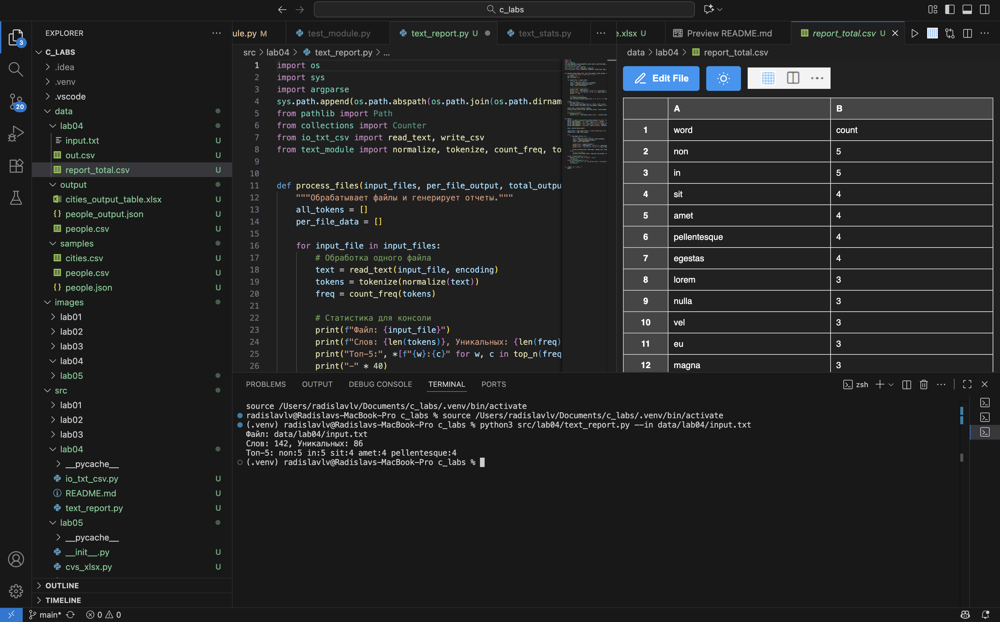

### Python BIVT-25-5 ЛР2 — Коллекции и матрицы
---

#### io_txt_csv.py **module**
``` python
import csv
from pathlib import Path
from typing import Iterable, Sequence

def read_text(path: str | Path, encoding: str = "utf-8") -> str:
    '''
    Reads and returns the content of a text file at the given path using the specified encoding. Default encoding is 'utf-8'.

    Parameters:
    path (str | Path): Path to the text file.
    encoding (str): Encoding to use when reading the file (default is 'utf-8').

    Returns: 
    str: Content of the text file as a string.
    '''
    file_path = Path(path)
    # FileNotFoundError и UnicodeDecodeError пусть «всплывают» — это нормально
    return file_path.read_text(encoding=encoding)


def write_csv(rows: Iterable[Sequence], path: str | Path, header: tuple[str, ...] | None = None) -> None:
    ''' 
    Writes data to a CSV file at the specified path. Creates parent directories if they don't exist.

    Parameters:
    rows (Iterable[Sequence]): Iterable containing data rows to write.
    path (str | Path): Path where the CSV file will be created.
    header (tuple[str, ...] | None): Optional header row for the CSV file.

    Raises:
    ValueError: If rows have inconsistent lengths.
    '''
    file_path = Path(path)
    rows_list = list(rows)
    
    # Validate that all rows have the same length
    if rows_list:
        first_row_length = len(rows_list[0])
        for i, row in enumerate(rows_list):
            if len(row) != first_row_length:
                raise ValueError(f"Row {i} has length {len(row)}, expected {first_row_length}")
    
    # Create parent directories if they don't exist
    file_path.parent.mkdir(parents=True, exist_ok=True)
    
    # Write CSV file
    with file_path.open('w', newline='', encoding='utf-8') as file:
        writer = csv.writer(file)
        if header is not None:
            writer.writerow(header)
        writer.writerows(rows_list)


def ensure_parent_dir(path: str | Path) -> None:
    ''' 
    Creates parent directories for the given path if they don't exist.

    Parameters:
    path (str | Path): File path for which to create parent directories.
    '''
    file_path = Path(path)
    file_path.parent.mkdir(parents=True, exist_ok=True)
```

#### text_report.py
``` python
import os
import sys
import argparse
sys.path.append(os.path.abspath(os.path.join(os.path.dirname(__file__), '../lib')))
from pathlib import Path
from collections import Counter
from io_txt_csv import read_text, write_csv
from text_module import normalize, tokenize, count_freq, top_n


def process_files(input_files, per_file_output, total_output, encoding):
    all_tokens = []
    per_file_data = []
    
    for input_file in input_files:
        # Обработка одного файла
        text = read_text(input_file, encoding)
        tokens = tokenize(normalize(text))
        freq = count_freq(tokens)
        
        # Статистика для консоли
        print(f"Файл: {input_file}")
        print(f"Слов: {len(tokens)}, Уникальных: {len(freq)}")
        print("Топ-5:", *[f"{w}:{c}" for w, c in top_n(freq, 5)])
        print("-" * 40)
        
        # Данные для отчетов
        all_tokens.extend(tokens)
        per_file_data.extend((input_file, w, c) for w, c in top_n(freq, len(freq)))
    
    # Запись отчетов
    if len(input_files) > 1:
        per_file_data.sort(key=lambda x: (x[0], -x[2], x[1]))
        write_csv(per_file_data, per_file_output, header=("file", "word", "count"))
    
    total_freq = count_freq(all_tokens)
    write_csv(top_n(total_freq, len(total_freq)), total_output, header=("word", "count"))
    
    # Сводная статистика
    if len(input_files) > 1:
        print(f"Всего: {len(input_files)} файлов, {len(all_tokens)} слов, {len(total_freq)} уникальных")


def main():
    parser = argparse.ArgumentParser(description='Генерация текстовых отчетов')
    parser.add_argument('--in', dest='input_files', nargs='+', help='Входные файлы')
    parser.add_argument('--per-file', dest='per_file_output', default='data/lab04/report_per_file.csv')
    parser.add_argument('--out', dest='total_output', default='data/lab04/report_total.csv')
    parser.add_argument('--encoding', dest='encoding', default='utf-8')
    
    args = parser.parse_args()
    
    input_files = args.input_files or ["data/lab04/input.txt"]
    output_file = args.total_output
    
    try:
        if len(input_files) == 1:
            # Один файл - простой отчет
            text = read_text(input_files[0], args.encoding)
            tokens = tokenize(normalize(text))
            freq = count_freq(tokens)
            
            print(f"Файл: {input_files[0]}")
            print(f"Слов: {len(tokens)}, Уникальных: {len(freq)}")
            print("Топ-5:", *[f"{w}:{c}" for w, c in top_n(freq, 5)])
            
            write_csv(top_n(freq, len(freq)), output_file, header=("word", "count"))
        else:
            # Несколько файлов
            process_files(input_files, args.per_file_output, args.total_output, args.encoding)
            
    except FileNotFoundError as e:
        print(f"Ошибка: файл не найден - {e}")
        sys.exit(1)
    except UnicodeDecodeError as e:
        print(f"Ошибка кодировки: {e}\nИспользуйте --encoding")
        sys.exit(1)


if __name__ == "__main__":
    main()
```

### Some runouts:

