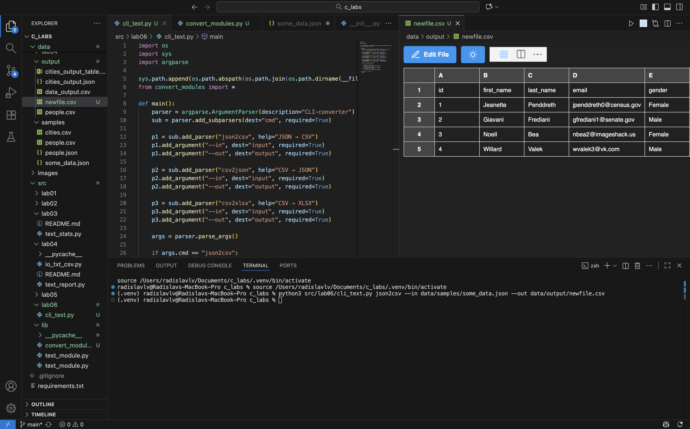
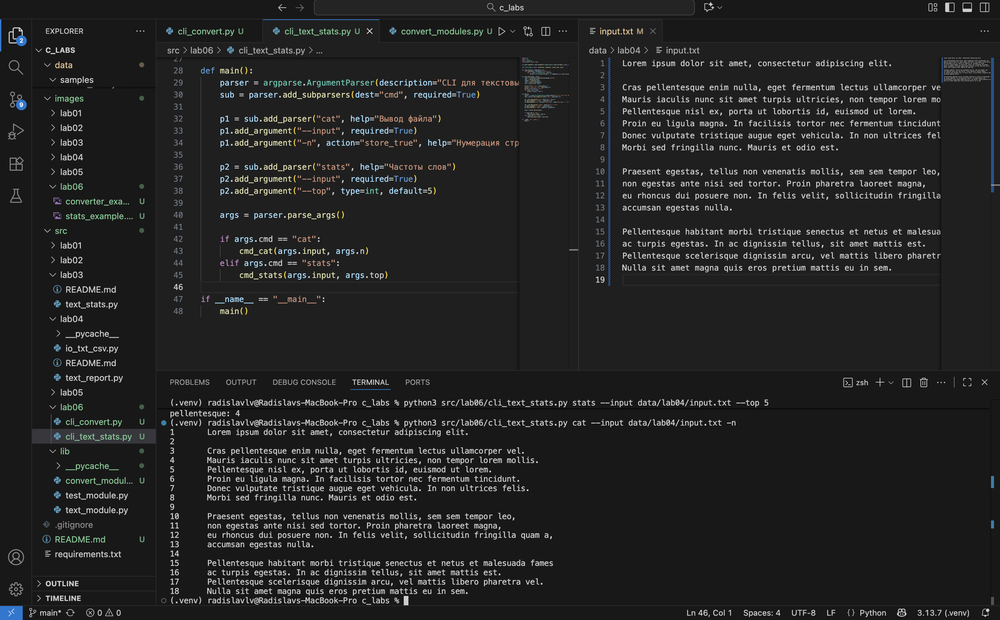
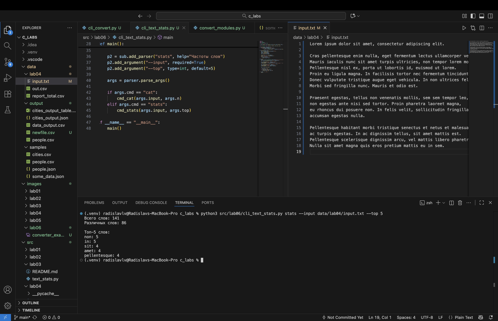

### Python BIVT-25-5 ЛР5 – JSON и конвертации (JSON↔CSV, CSV→XLSX):
---

#### cli_convert.py
``` python
import os
import sys
import argparse

sys.path.append(os.path.abspath(os.path.join(os.path.dirname(__file__), '../lib')))
from convert_modules import *

def main():
    parser = argparse.ArgumentParser(description="CLI-converter")
    sub = parser.add_subparsers(dest="cmd", required=True)

    p1 = sub.add_parser("json2csv", help="JSON → CSV")
    p1.add_argument("--in", dest="input", required=True)
    p1.add_argument("--out", dest="output", required=True)

    p2 = sub.add_parser("csv2json", help="CSV → JSON")
    p2.add_argument("--in", dest="input", required=True)
    p2.add_argument("--out", dest="output", required=True)

    p3 = sub.add_parser("csv2xlsx", help="CSV → XLSX")
    p3.add_argument("--in", dest="input", required=True)
    p3.add_argument("--out", dest="output", required=True)

    args = parser.parse_args()

    if args.cmd == "json2csv":
        json_to_csv(args.input, args.output)
    elif args.cmd == "csv2json":
        csv_to_json(args.input, args.output)
    elif args.cmd == "csv2xlsx":
        csv_to_xlsx(args.input, args.output)

if __name__ == "__main__":
    main()
```

#### cli_text_stats.py
``` python
import os
import sys
import argparse
from pathlib import Path

sys.path.append(os.path.abspath(os.path.join(os.path.dirname(__file__), '../lib')))

from text_module import normalize, tokenize, count_freq, top_n

def cmd_cat(path, numbered=False):
    with open(path, encoding="utf-8") as f:
        for i, line in enumerate(f, start=1):
            print(f"{i}\t{line.rstrip()}" if numbered else line.rstrip())

def cmd_stats(path, top_k):
    text = Path(path).read_text(encoding="utf-8")
    text = normalize(text)
    tokens = tokenize(text)
    freq = count_freq(tokens)
    top = top_n(freq, top_k)

    print(f"Всего слов: {len(tokens)}")
    print(f"Различных слов: {len(freq)}\n")
    print(f"Топ-{top_k} слов:")
    for word, cnt in top:
        print(f"{word}: {cnt}")

def main():
    parser = argparse.ArgumentParser(description="CLI для текстовых операций (lab06)")
    sub = parser.add_subparsers(dest="cmd", required=True)

    p1 = sub.add_parser("cat", help="Вывод файла")
    p1.add_argument("--input", required=True)
    p1.add_argument("-n", action="store_true", help="Нумерация строк")

    p2 = sub.add_parser("stats", help="Частоты слов")
    p2.add_argument("--input", required=True)
    p2.add_argument("--top", type=int, default=5)

    args = parser.parse_args()

    if args.cmd == "cat":
        cmd_cat(args.input, args.n)
    elif args.cmd == "stats":
        cmd_stats(args.input, args.top)

if __name__ == "__main__":
    main()
```


### Some runouts:
**convert example** with using json2csv


**cat example** with **-n** turned on - numeration enabled


**stats example** with **--topn** 5 - print tip five words


