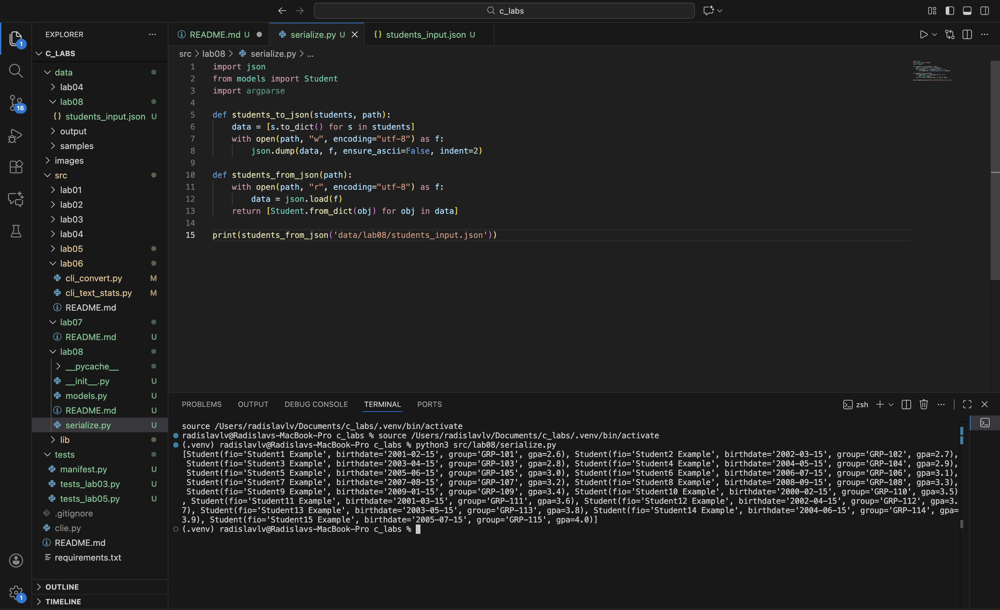

### Python BIVT-25-5 ЛР8 – ООП в Python: @dataclass Student, методы и сериализация:
---

#### models.py
``` python
from dataclasses import dataclass
from datetime import datetime, date

@dataclass
class Student:
    fio: str
    birthdate: str
    group: str
    gpa: float

    def __str__(self):
        return f'Obj Student. fio: {self.fio}, birthdate: {self.birthdate}, group: {self.group}, gpa: {self.gpa}'
    
    def __post_init__(self):
        if isinstance(self.gpa, str) or self.gpa < 0 or self.gpa > 5:
            raise ValueError('Invalid GPA-score')
        try:
            self._date_of_birth = datetime.strptime(self.birthdate, '%Y-%m-%d')
        except:
            raise ValueError('Invalid date format')
    
    @property
    def age(self) -> any:
        return date.today().year - self._date_of_birth.year
    
    def to_dict(self) -> dict:
        return {
            "fio": self.fio,
            "birthdate": self.birthdate,
            "group": self.group,
            "gpa": self.gpa
        }
    
    @classmethod
    def from_dict(cls, d: dict):
        return Student(d["fio"], d["birthdate"], d["group"], d["gpa"])
```

#### serialize.py --> with argparse usage (idk why)
``` python
import json
from models import Student
import argparse

def students_to_json(students, path):
    data = [s.to_dict() for s in students]
    with open(path, "w", encoding="utf-8") as f:
        json.dump(data, f, ensure_ascii=False, indent=2)

def students_from_json(path):
    with open(path, "r", encoding="utf-8") as f:
        data = json.load(f)
    return [Student.from_dict(obj) for obj in data]
```


### Some runouts:
**serialize example1** with obj2json


**serialize example2** with json2obj


